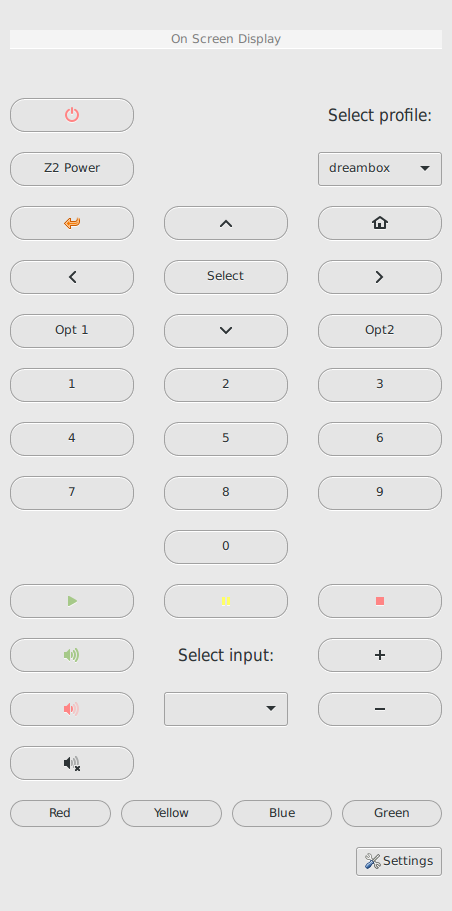

GunRC - GTK Universal Network Remote Control
============================================

A GTK-3 remote control for network-connected devices such as:

* Recivers
* Decoders
* Televisions

It uses a XML-based template system, so it's easy to add devices and functions.

Currently it supports:

* Pioneer VSX-series Reciver
	+ Turn "Network Standby" on
* Enigma devices such as dreambox, vuplus etc

Using GunRC
============

    usage: gunrc.py [-h] [-V] [-d] [-l {profiles,commands}] [-c PROFILE COMMAND]

    cli example: gunrc -c default play

    optional arguments:
     
+------------------------+----------------------------------------+
| Option                 | Description                            | 
+========================+========================================+ 
| -h, --help             | how this help message and exit         | 
+------------------------+----------------------------------------+
| -V, --version          | show program's version number and exit | 
+------------------------+----------------------------------------+ 
| -d                     | turn on for debugging                  | 
+------------------------+----------------------------------------+ 
| -l {profiles,commands} | list available profiles or commands    | 
+------------------------+----------------------------------------+ 
| -c PROFILE COMMAND     | send COMMAND to device in PROFILE      | 
+------------------------+----------------------------------------+ 

Requirements
------------

In order to run GunRC, you will need the following dependencies:

* Python >= 3.2
* `PyGObject`_ (aka Python GObject Introspection) (3.7.4 or more recommended,
  earlier versions may also work)
* GTK >= 3.4

.. _PyGObject: https://live.gnome.org/PyGObject

GunRC can currently be downloaded from the Git repository using::

    $ git clone git://github.com/maccyber/gunrc.git
    $ cd gunrc

To run GunRC, you can install it in a dedicated directory (as root)::

    # python setup.py install
